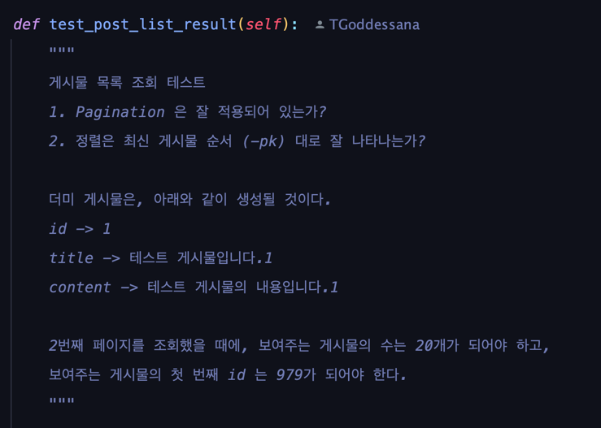
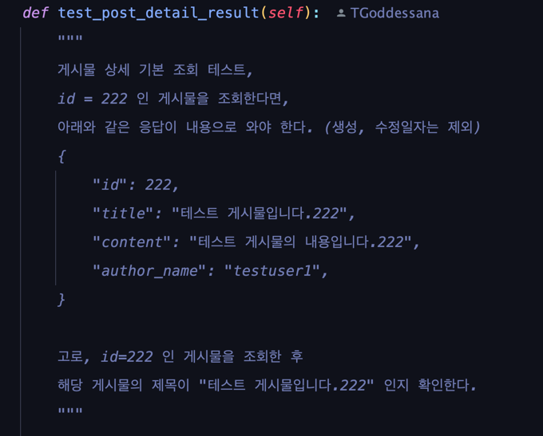
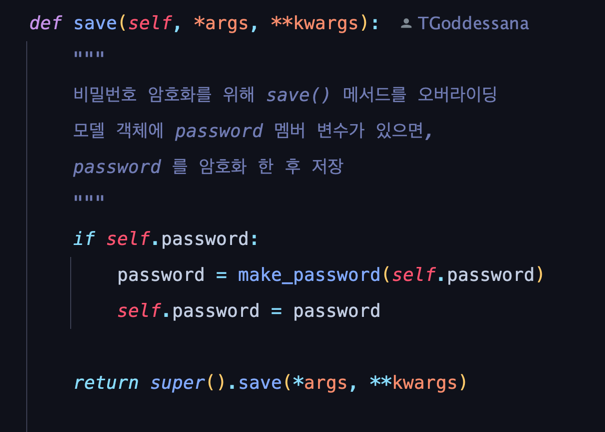
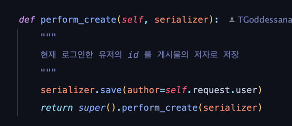
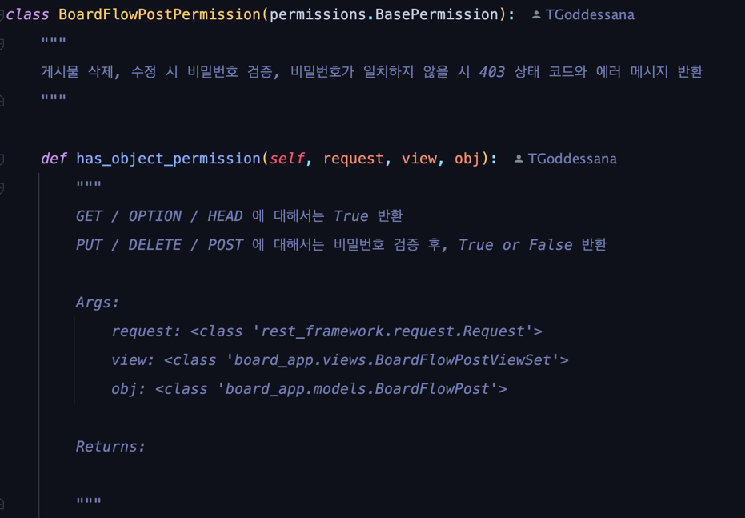
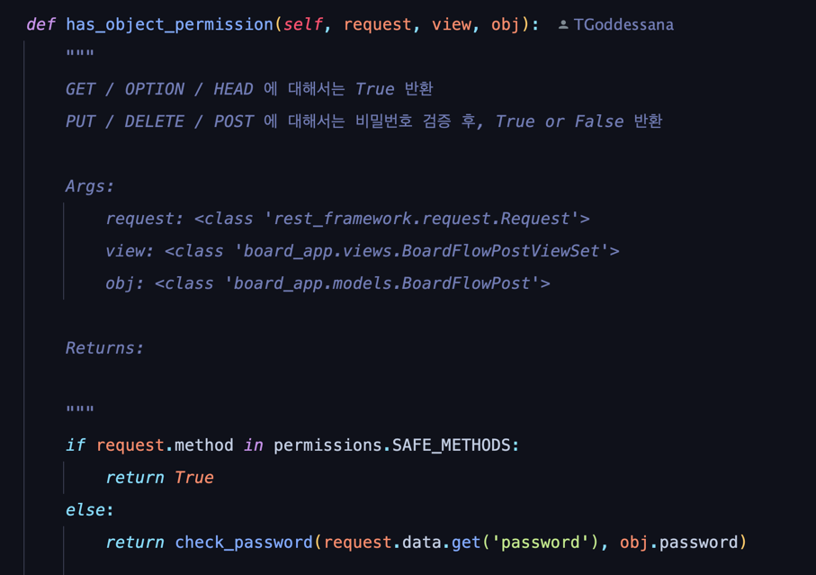
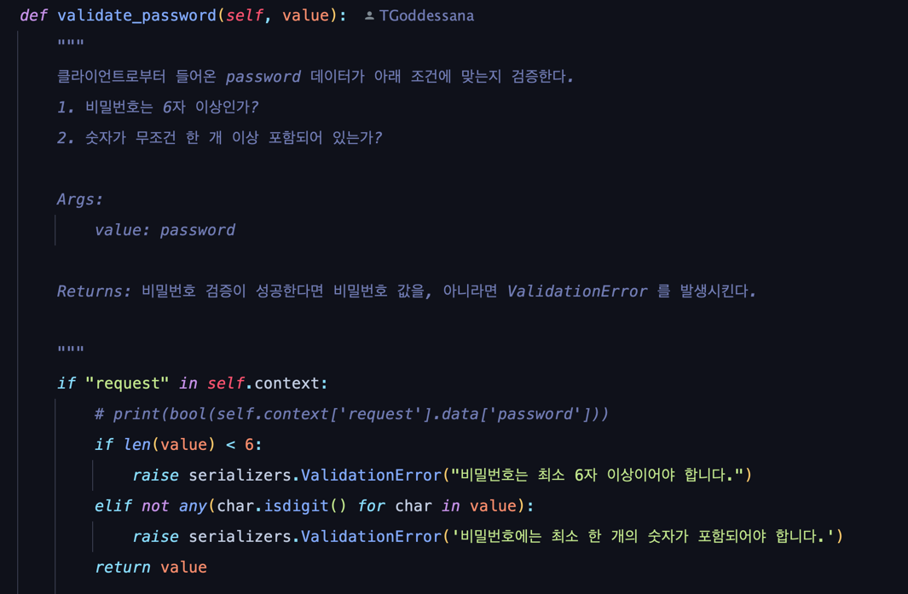

# BoardFlow REST API
##
## :bulb: 소개
게시물 비밀번호 로직이 적용된 게시판 서비스를 위한 REST API 입니다.

- 사용자는 게시글을 올릴 수 있습니다.
- 사용자는 게시물을 작성할 때에 비밀번호를 설정할 수 있습니다.
  - 비밀번호만 일치한다면, 수정과 삭제가 가능합니다.
  - 비밀번호는 데이터베이스에 특정 알고리즘으로 암호화되어 저장됩니다.
  - 비밀번호는 6자 이상이어야 하고, 숫자 한 개 이상이 반드시 포함되어야 합니다.
- Pagination 이 적용되어 사용자는 게시물을 '최신 순으로, 20개씩' 확인할 수 있습니다.

## :package: 설치하기

    git clone https://github.com/TGoddessana/boardflow.git
    pip install requirements.txt

    # 개발용이라면,
    pip install requirements/development.txt
    
    # 배포용이라면,
    pip install requirements/production.txt

## :rocket: 어플리케이션 실행하기
    # manage.py 에서 원하는 버전의 settings 환경 변수 설정
    # 개발용이라면, boardflow.settings.development
    # 배포용이라면, boardflow.settings.production
    # 기본값은 아래와 같이 설정되어 있음
    # os.environ.setdefault('DJANGO_SETTINGS_MODULE', 'boardflow.settings.development')
    
    python manage.py runserver

## :fire: 테스트 코드 실행하기

    python manage.py test

---

# :zap: REST API 명세

## 게시물의 목록을 조회합니다. 20개 단위로 pagination 처리되어 있고, 최신 게시물 순서대로 조회합니다.

### Request

`GET /api/v1/boardflow/posts/`

    import requests
    
    url = "http://127.0.0.1:8000/api/v1/boardflow/posts/?page=2"
    
    payload={}
    headers = {}
    
    response = requests.request("GET", url, headers=headers, data=payload)
    
    print(response.text)

### Response

    {
        "count": 38,
        "next": "http://127.0.0.1:8000/api/v1/boardflow/posts/?page=2",
        "previous": null,
        "results": [
            {
                "id": 76,
                "created_at": "2022-09-07T14:06:34.840644Z",
                "updated_at": "2022-09-07T14:06:35.037291Z",
                "title": "aabb",
                "content": "a",
                "author_name": "goddessana"
            },
            {
                "id": 75,
                "created_at": "2022-09-07T14:05:55.122398Z",
                "updated_at": "2022-09-07T14:05:55.311088Z",
                "title": "aabb",
                "content": "a",
                "author_name": "goddessana"
            },
            {
                "id": 74,
                "created_at": "2022-09-07T14:04:24.235364Z",
                "updated_at": "2022-09-07T14:04:24.481124Z",
                "title": "aabb",
                "content": "a",
                "author_name": "goddessana"
            },
            {
                "id": 73,
                "created_at": "2022-09-07T14:02:55.200588Z",
                "updated_at": "2022-09-07T14:02:55.407460Z",
                "title": "aabb",
                "content": "a",
                "author_name": "goddessana"
            },
            {
                "id": 72,
                "created_at": "2022-09-07T14:02:30.029410Z",
                "updated_at": "2022-09-07T14:02:30.221677Z",
                "title": "aabb",
                "content": "a",
                "author_name": "goddessana"
            },
            {
                "id": 71,
                "created_at": "2022-09-07T14:01:09.505108Z",
                "updated_at": "2022-09-07T14:01:09.693442Z",
                "title": "aabb",
                "content": "a",
                "author_name": "goddessana"
            },
            # 생략 ...
            {
                "id": 56,
                "created_at": "2022-09-07T11:57:20.868381Z",
                "updated_at": "2022-09-07T11:57:21.053749Z",
                "title": "aa",
                "content": "a",
                "author_name": "goddessana"
            }
        ]
    }

## 새 게시물을 생성합니다.

### Request

`POST /api/v1/boardflow/posts/`
    
    import requests
    import json
     
    url = "http://127.0.0.1:8000/api/v1/boardflow/posts/"
     
    payload = json.dumps({
      "title": "안녕하세요, 좋은 하루입니다. ⚡",
      "content": "부디, 번개만 치지 않았으면 좋겠네요!",
      "password": "password1234"
    })
    headers = {
      'X-CSRFToken': 'JZM5WnMDYinhAELaQOzIYjlhBn0PEQF1',
      'Content-Type': 'application/json'
    }
     
    response = requests.request("POST", url, headers=headers, data=payload)
     
    print(response.text)

### Response

    {
        "id": 79,
        "created_at": "2022-09-07T15:11:22.295401Z",
        "updated_at": "2022-09-07T15:11:22.481164Z",
        "title": "안녕하세요, 좋은 하루입니다. ⚡",
        "content": "부디, 번개만 치지 않았으면 좋겠네요!",
        "author_name": "goddessana"
    }

## 특정 게시물을 조회합니다.

### Request

`GET /api/v1/boardflow/posts/<id>`

    import requests

    url = "http://127.0.0.1:8000/api/v1/boardflow/posts/79"
    
    payload={}
    headers = {}
    
    response = requests.request("GET", url, headers=headers, data=payload)
    
    print(response.text)

### Response

    {
        "id": 79,
        "created_at": "2022-09-07T15:11:22.295401Z",
        "updated_at": "2022-09-07T15:11:22.481164Z",
        "title": "안녕하세요, 좋은 하루입니다. ⚡",
        "content": "부디, 번개만 치지 않았으면 좋겠네요!",
        "author_name": "goddessana"
    }

## 특정 게시물을 수정합니다.

### Request

`PUT /api/v1/boardflow/posts/<id>`

    
    import requests
    import json
    
    url = "http://127.0.0.1:8000/api/v1/boardflow/posts/79/"
    
    payload = json.dumps({
      "title": "결국 번개가 치네요.",
      "content": "집에 피뢰침이 설치되어 있어 다행입니다!",
      "password": "password1234"
    })
    headers = {
      'Content-Type': 'application/json',
      'X-CSRFToken': 'JZM5WnMDYinhAELaQOzIYjlhBn0PEQF1'
    }
    
    response = requests.request("PUT", url, headers=headers, data=payload)
    
    print(response.text)

### Response

    {
        "id": 79,
        "created_at": "2022-09-07T15:11:22.295401Z",
        "updated_at": "2022-09-07T15:13:05.272090Z",
        "title": "결국 번개가 치네요.",
        "content": "집에 피뢰침이 설치되어 있어 다행입니다!",
        "author_name": "goddessana"
    }

## 특정 게시물을 삭제합니다.

### Request

`DELETE /api/v1/boardflow/posts/<id>`

    import requests
    import json
     
    url = "http://127.0.0.1:8000/api/v1/boardflow/posts/79/"
     
    payload = json.dumps({
      "password": "password1234"
    })
    headers = {
      'X-CSRFToken': 'JZM5WnMDYinhAELaQOzIYjlhBn0PEQF1',
      'Content-Type': 'application/json'
    }
     
    response = requests.request("DELETE", url, headers=headers, data=payload)
     
    print(response.text)

### Response

    해당 요청은 response body 를 제공하지 않습니다.

---
## :sparkles: 테스트 코드에서 검증한 것
두 가지에 대하여 검증을 진행하였습니다.  
  
  
`python manage.py test` 로 테스트를 수행할 수 있습니다.
---
## :fire: 각각 특징별 구현했던 방법
#### 비밀번호가 저장될 때에 암호화되어 저장됨
models.py 단에서, 해당 모델에 대한 save() 메서드를 재정의함으로서 구현하였습니다.  
  
#### 게시물을 작성할 때에, 로그인한 유저가 저자로 자동 추가됨
views.py 단에서, perform_create() 메서드를 재정의함으로서 구현하였습니다.  
   
#### 게시물 비밀번호가 일치해야지만 해당 게시물에 대한 수정/삭제를 수행할 수 있음
permissions.py 파일을 생성하고, has_objcet_permissions 메서드를 재정의함으로서 구현하였습니다. 비밀번호가 일치하지 않을 시 403 상태 코드와 함께
에러 메시지를 나타냅니다.  
  
  
#### 게시물 비밀번호 설정 시, 비밀번호는 6자 이상이어야 하고 숫자 한 개가 반드시 포함되어야 함
serializers.py 에서 별도의 검증 메서드를 정의하여 구현하였습니다.  
   
